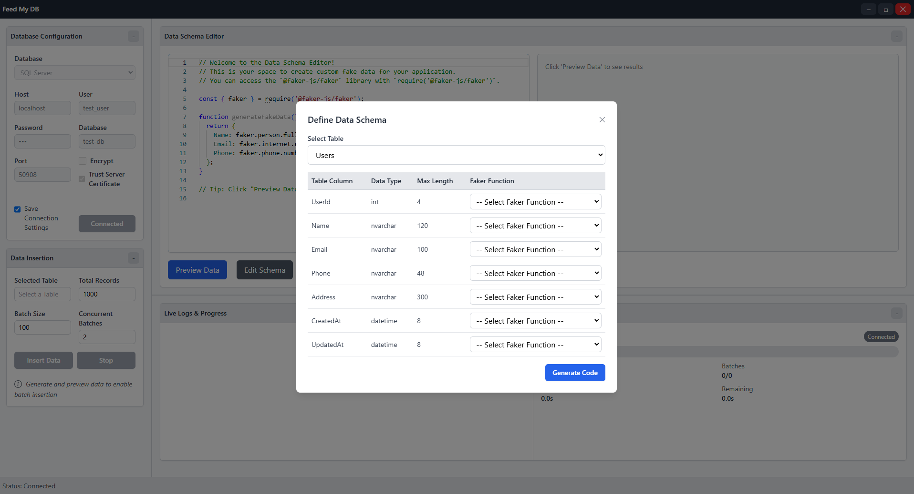
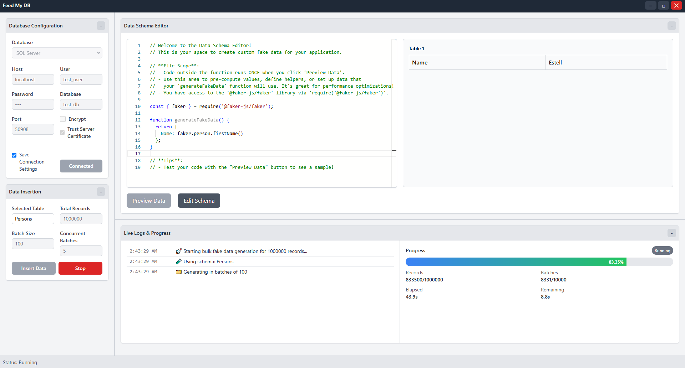

# Feed My DB

**Feed My DB** is an open-source desktop application for generating and inserting synthetic fake data into databases. Built with React, TypeScript, Electron, and powered by Faker.js, it allows users to define data schemas, preview generated data, and perform batch insertions with ease. Whether you're testing applications, populating databases for development, or simulating real-world datasets, Feed My DB has you covered.

## Features

- **Database Connectivity**: Connect to your database with a simple configuration panel.
- **Schema Definition**: Use the "Data Schema Editor" to select tables and assign Faker.js methods to columns.
- **Code Generation**: Automatically generates JavaScript code using Faker.js based on your schema.
- **Data Preview**: Preview synthetic data before insertion to ensure accuracy.
- **Batch Insertion**: Insert large datasets into your database with progress tracking and a cancel option.
- **Customizable**: Edit generated code directly in the Monaco Editor for full control.
- **User-Friendly UX**: Intuitive panels, animations, and feedback.

## Screenshots

## Usage

- **Connect to a Database:**
  - Open the "Database Configuration" panel.
  - Enter your database details.
  - Click "Connect".
- Define Your Schema:
  - In the "Data Schema Editor," click "Edit Schema."
  - Select a table and assign Faker.js methods (e.g., faker.name.fullName()) to columns.
  - Click "Generate Code" to create executable JavaScript.
- Preview Data:
  - Click "Preview Data" to see a sample of the generated data in the right panel.
- Insert Data:
  - In the "Data Insertion" panel, click "Insert Data."
  - Monitor the progress bar at the bottom; cancel if needed with "Stop" button
- Customize (Optional):
  - Edit the generated code in the Monaco Editor and re-run to tweak the output.

## Tech Stack

- **Frontend**: React, TypeScript, Tailwind CSS
- **Desktop Framework**: Electron
- **Code Editor**: Monaco Editor
- **Fake Data**: Faker.js (`@faker-js/faker`)
- **Database**: Supports SQLite (extendable to others via custom configuration)

## Contributing

We welcome contributions! To get started:

- Fork the repository.
- Create a feature branch (git checkout -b feature/your-feature).
- Commit your changes (git commit -m "Add your feature").
- Push to your branch (git push origin feature/your-feature).
- Open a Pull Request.

Please follow the and check the for details.

## Roadmap

- Support for additional databases.
  - [ ] SQL Server
  - [ ] Azure SQL
  - [ ] MySQL
  - [ ] PostgresSQL
  - [ ] MongoDB
- Support for generating related table using foreign key
- Predefined schema templates for common use cases.
- Advanced Faker.js options (e.g., custom constraints, relationships).

## Acknowledgments

- Built with love using React, Electron, and Faker.js.
- Inspired by the need for quick, reliable database testing data.

## Contact

Have questions or ideas? Open an issue or reach out:

- GitHub: rezve
- Email: hello@rezve.com

Happy data feeding with **Feed My DB**!
